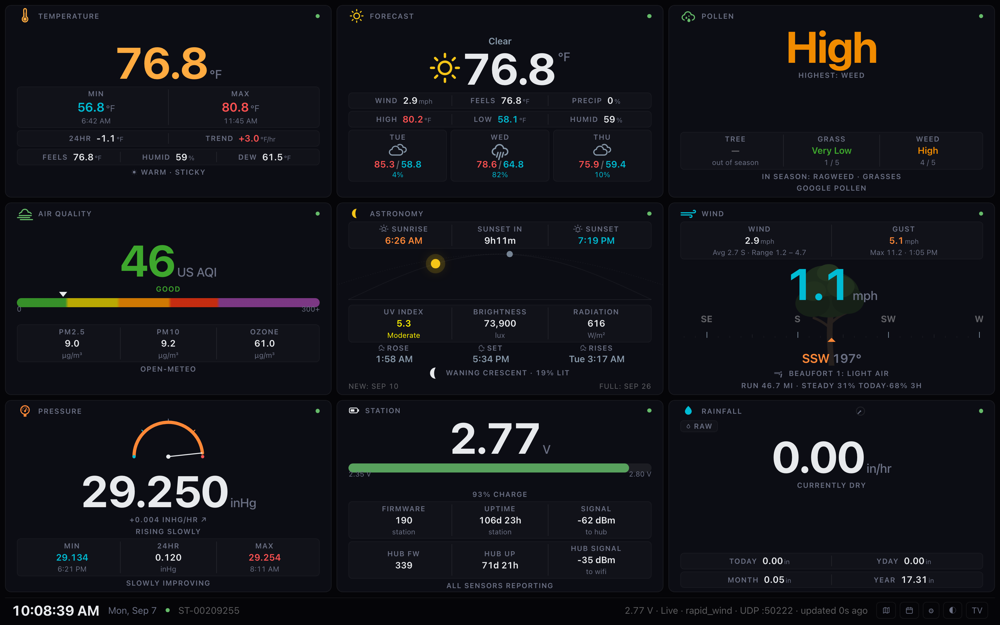

# Tempest Weather Dashboard

A self-hosted dashboard for a [WeatherFlow Tempest](https://weatherflow.com/tempest-weather-system/)
station. It listens for the hub's UDP broadcasts on your own network and
serves a web page you can open from anything — or leave up on a TV.

No account, no API key and no `pip install` for the station data itself. It is
Python standard library throughout, and the page has no build step and pulls
nothing from a CDN.

Built to run on a NAS. It runs on a Synology DS723+.

**Author:** Chris Goodman &nbsp;·&nbsp; Built with [Claude](https://claude.ai) (Anthropic)

   



*Live station data, twelve cards, dark and light themes. Every hero number
is a unit toggle — click it to cycle °F / °C / K, mph / km/h / m/s / kts,
and so on. The choice is remembered per browser, so the TV and your phone
can disagree.*

---

## Quick start

```bash
python3 tempest_server.py --lat 45.4215 --lon -75.6972   # your own coordinates
```

Open `http://<that-host>:8444/`. The server prints the addresses it can be
reached on when it starts.

No hub to hand? `--demo` synthesises a plausible day — warmest mid-afternoon,
sun following the clock — so the whole dashboard has something to show.

```
tempest_core.py      measurements, meteorology, sun and moon, history, UDP listener
tempest_server.py    the web server, and the forecast, alert and backfill fetchers
web/index.html       the dashboard — one file, no build step, no CDN
web/fonts/           Weather Icons (SIL OFL 1.1), vendored
web/favicon.svg      tab icon, with PNG fallbacks beside it for iOS
Dockerfile           for Synology Container Manager
docker-compose.yml
deploy.sh            ship this checkout to the NAS and rebuild
```

---

## What is on it

Thirteen cards. Pick which ones you want and drag them into the order you like —
the grid rearranges itself for however many you choose.

| Card | Shows |
|---|---|
| **Temperature** | Now, 24-hour min and max with the times they happened, 24-hour change, hourly trend, feels-like, humidity, dew point, and a comfort read |
| **Wind** | Average and gust with the day's peak, a live rapid-wind hero, a compass strip that slides under a fixed marker, Beaufort force, 24-hour wind run and steadiness |
| **Pressure** | A dial scaled to the 24-hour range, hourly rate of change, barometric tendency, min/max/span, and an outlook line |
| **Rainfall** | Current rate, today and yesterday, month and year to date |
| **Astronomy** | Sunrise, sunset, time to the next, a daylight arc with the sun on it, UV with its WHO band, brightness, solar radiation, moonrise, moonset, phase and the next new and full moon |
| **Forecast** | Current conditions, today's high, low and precipitation chance, and a three-day strip |
| **Records** | Hottest and coldest with dates, for the month, the year and all time, over a band showing the station's whole range |
| **Lightning** | Strikes today, nearest, last strike, last hour and last three hours |
| **Radar** | Live radar for your location |
| **Air quality** | US AQI on a banded scale, with PM2.5, PM10 and ozone (Open-Meteo, no key) |
| **Pollen** | Tree, grass and weed indices with the season's active allergens (Google Pollen, key needed) |
| **Internet** | Download and upload from a self-hosted Speedtest Tracker, with a health word driven by packet loss, jitter and latency under load rather than by speed. Turns over to a plot of the last day's tests |
| **Station** | Battery voltage and charge, station and hub firmware, uptime, signal strength, and any sensor faults |

Three more pages, each behind an icon in the footer:

- **Ten-day outlook** (`d`) — the full forecast, each day's range drawn against
  the ten-day span so a warm spell or a cold snap reads at a glance.
- **Radar** (`w`) — full-screen weather map.
- **Settings** (`s`) — choose and reorder cards, and set the optional
  WeatherFlow token.

Switching between them uses the browser's native View Transitions, so there is
no animation library involved.

---

## Hosting it on a Synology NAS

### The one thing that will bite you

The hub **broadcasts** over UDP. Broadcasts do not cross Docker's bridge
network, and they do not cross subnets or VLANs. So the container must use
`network_mode: host`, and the NAS must be on the same subnet as the hub.

A bridged container starts cleanly and then sits at "no hub seen yet" forever.
The page says so after a minute rather than leaving you guessing.

### Deploying over SSH

Enable **Control Panel → Terminal & SNMP → SSH**, then:

```bash
# 1. authorise your key (you are asked for the DSM password once)
ssh-copy-id -i ~/.ssh/id_ed25519.pub YOURUSER@YOUR-NAS
ssh YOURUSER@YOUR-NAS 'chmod 700 ~/.ssh; chmod 600 ~/.ssh/authorized_keys; chmod 755 ~'

# 2. ship the files. DSM restricts SFTP, so stream a tar over ssh
tar czf - tempest_core.py tempest_server.py web Dockerfile \
    docker-compose.yml .dockerignore \
  | ssh YOURUSER@YOUR-NAS 'mkdir -p /volume1/docker/tempest && \
      tar xzf - -C /volume1/docker/tempest'

# 3. tell the container which host user owns ./data
ssh YOURUSER@YOUR-NAS 'cd /volume1/docker/tempest && mkdir -p data && \
  printf "PUID=%s\nPGID=%s\n" "$(id -u)" "$(id -g)" > .env'

# 4. build and start
ssh YOURUSER@YOUR-NAS 'cd /volume1/docker/tempest && \
  /usr/local/bin/docker compose up -d --build'
```

Your DSM account needs to be in **administrators** (for SSH) and **docker** (so
`docker` works without sudo — Container Manager adds administrators to it).
Check with `id`.

### Updating it afterwards

Step 1 is the only part you do once. After that `deploy.sh` is the same four
steps in one command, run from a machine on the LAN whose key the NAS knows:

```bash
NAS=YOURUSER@YOUR-NAS ./deploy.sh
```

It ships the code, fixes the permissions, rebuilds, and then waits until the
NAS is actually serving the page you just sent — the server reports a digest
of `web/index.html` in `/api/state`, so "deployed" means the new page is up,
not merely that docker exited zero.

It deliberately leaves `docker-compose.yml`, `.env` and `data/` alone. Those
hold your location, your units, your tokens and your history, and they are
meant to differ from what is in git.

Every run writes a transcript to `deploy-logs/`, gitignored, last twenty kept.
The terminal shows one line per step; the log holds every command, its whole
output, its exit code and how long it took, plus the local tar and ssh
versions and a listing of what was shipped. When a step fails the log also
gets a diagnostic sweep of the NAS — container state, the last eighty lines
of container log, free space, and any shipped file the container's uid cannot
read. That last one is worth knowing about: it is the "Missing index.html"
failure, and it looks like a much more interesting bug than it is.

The step called **verify what landed** hashes `web/index.html` where it
arrived, before the build starts. Without it a stale page has two causes that
look identical from the outside — the files never arrived, or they arrived and
the container did not restart. With it, the run says which.

`NAS`, `APP`, `PORT`, `DOCKER` and `TRIES` can all be overridden from the
environment.

Three DSM quirks worth knowing:

- `/tmp` and SFTP are locked down, hence `tar | ssh` rather than `scp`.
- `docker` is not on the `PATH` of a non-login shell; use `/usr/local/bin/docker`.
- The bind-mounted `data/` belongs to your DSM user, so the container has to
  run as that uid. That is what `.env` is for — without it the container starts
  and then cannot write its history.

### Container Manager instead

Copy the folder to `/volume1/docker/tempest`, edit `docker-compose.yml`, create
the `.env`, then **Container Manager → Project → Create**. If DSM's firewall is
on, allow inbound TCP on your port and UDP 50222.

---

## Configuring it

Most things can be set two ways: on the server, or from the settings page. The
settings page wins, because it is written to `tempest_config.json` at runtime.

| Flag | Environment | Default | Meaning |
|---|---|---|---|
| `--host` | `TEMPEST_HOST` | `0.0.0.0` | Address to bind to |
| `--http-port` | `TEMPEST_HTTP_PORT` | `8444` | Web server port |
| `--udp-port` | `TEMPEST_UDP_PORT` | `50222` | Hub broadcast port |
| `--lat` / `--lon` | `TEMPEST_LAT` / `TEMPEST_LON` | unset | Station location, for sun, moon, forecast, alerts and radar |
| `--name` | `TEMPEST_NAME` | station serial | Label in the footer |
| `--slots` | `TEMPEST_SLOTS` | six cards | Which cards, in order |
| `--wf-token` | `TEMPEST_WF_TOKEN` | unset | WeatherFlow token for history backfill |
| `--speedtest-url` | `TEMPEST_SPEEDTEST_URL` | `http://127.0.0.1:8080` | Base URL of your Speedtest Tracker instance, for the Internet card |
| `--plan-down` | `TEMPEST_PLAN_DOWN` | `0` | Advertised download rate in Mbps, so the card can show what fraction you are getting |
| `--plan-up` | `TEMPEST_PLAN_UP` | `0` | Advertised upload rate in Mbps |
| `--rain-normal` | `TEMPEST_RAIN_NORMAL` | `0` | A normal year's rainfall where you are, in inches, so the Rainfall card can fill against it. NOAA publishes these |
| `--rain-monthly` | `TEMPEST_RAIN_MONTHLY` | unset | The same thing month by month — twelve figures in inches, January first, comma separated. Overrides `--rain-normal`, and makes the card's pace mark honest |
| `--temp-normal-high` | `TEMPEST_TEMP_NORMAL_HIGH` | unset | Twelve normal monthly high temperatures in Fahrenheit, January first. Drawn behind the Temperature trace |
| `--temp-normal-low` | `TEMPEST_TEMP_NORMAL_LOW` | unset | Twelve normal monthly lows, also Fahrenheit. Both are needed or neither is used |
| `--data-dir` | `TEMPEST_DATA_DIR` | beside the script | Where history is written |
| `--demo` | `TEMPEST_DEMO` | off | Synthetic weather, no hub |
| `--no-forecast` | `TEMPEST_NO_FORECAST` | on | Disable the forecast fetch |
| `--no-alerts` | `TEMPEST_NO_ALERTS` | on | Disable weather alerts |
| `--no-observations` | `TEMPEST_NO_OBSERVATIONS` | on | Stop asking the nearest NWS station what is falling (the snow, sleet and freezing rain the Tempest cannot see) |
| `--obs-stations` | `TEMPEST_OBS_STATIONS` | two nearest | NWS stations to ask what is falling, e.g. `KDPA,KDKB` |

> Prefer the settings page for the token. `docker-compose.yml` is committed to
> git; `tempest_config.json` is gitignored and written `0600`.

### Units and keys

Units are a *starting* choice — click any big number to cycle it, and that
browser remembers. Temperature, wind, pressure, rain and distance are all
independent.

| Key | Action |
|---|---|
| `d` | Ten-day outlook |
| `w` | Radar |
| `s` | Settings |
| `t` | Light / dark |
| `f` | TV layout |
| `Esc` | Back to the cards |

---

## Where the data comes from

**Your hub, over UDP.** Everything on the Temperature, Wind, Pressure,
Rainfall and Lightning cards is measured by your own station. Nothing leaves
your network for any of it.

**Computed locally.** Sunrise, sunset, moonrise, moonset, moon phase and the
next new and full moon are worked out on the machine from your latitude and
longitude — no network call. Dew point, heat index, wind chill, Beaufort
force, wind run and barometric tendency likewise.

**Open-Meteo**, for the forecast. Free, no account, no key. It is cached to
disk and reused, so restarting costs nothing, and `--no-forecast` turns it off.

**The US National Weather Service**, for active alerts. No key. Outside NWS
coverage it simply returns nothing.

**WeatherFlow**, optionally, to backfill history. The hub only broadcasts what
is happening now, so without this the 24-hour figures and the monthly and
yearly totals only count from when the dashboard started. Give it a personal
access token and it fills in your station's real record — daily rainfall and
daily highs and lows, back to the day the station was installed.

### Endpoints

| Path | Returns |
|---|---|
| `/api/state` | Everything, in canonical units (°C, mb, m/s, mm, km) |
| `/api/wind` | Just the live wind — a few dozen bytes, polled often |
| `/api/config` | The card layout, and whether a token is set (never the token) |
| `/healthz` | `{"ok": true, "health": "live"}` |

`/api/state` is a stable shape. If you want to feed this into Home Assistant,
Grafana or a script of your own, poll that.

---

## Staying up

This is meant to sit on a screen nobody touches, so it looks after itself.

- If the hub listener thread dies, the server notices within thirty seconds
  and rebuilds it.
- If the page loses contact for four minutes it reloads, and it refreshes once
  a day when healthy. Reloads are rate-limited across page loads, so a server
  that is genuinely down cannot cause a loop.
- The last observation is saved and restored, so a restart comes back
  populated rather than blank for a minute. Freshness still reflects real
  packets only — the dot never lies about how old the data is.
- The container is `restart: unless-stopped` with a healthcheck.

## On a TV

Add `?tv` for the big-screen layout: larger type throughout, no cursor, no
controls. `f` toggles it.

The whole page drifts through a few pixels on a slow cycle, and TV mode pulls
peak brightness back slightly. Both reduce the risk of burning a static layout
into an OLED. It reduces the risk rather than removing it — a sleep schedule on
the TV itself still does more.

### Checking the alert banner

Severe weather alerts appear above the cards, coloured by severity, worst
first. Extreme is filled rather than outlined — at TV distance a tornado
warning should not read as the same thing as a small-craft advisory.

You will mostly see nothing, which is the point. To check it renders on your
screen without waiting for weather, add `?testalert`:

| | |
|---|---|
| `?testalert` | one sample of every severity |
| `?testalert=extreme` | just that one |
| `?testalert=minor,unknown` | the quieter end of the scale |

Samples are prefixed `PREVIEW` so they cannot be mistaken for live warnings.

---

## Requirements

- Python 3.8 or later, standard library only
- A Tempest hub on the same LAN subnet
- No GUI toolkit, so it runs headless on a NAS or server
- Optional: the [Inter](https://rsms.me/inter/) font; without it the page falls
  back to the platform UI font

## Files it writes

All live in `--data-dir` and are safe to delete — they are rebuilt.

| File | Contents |
|---|---|
| `tempest_history.json` | 48 hours of samples, plus per-day rainfall and per-day temperature extremes |
| `tempest_config.json` | Card layout and the WeatherFlow token (`0600`) |
| `tempest_server_state.json` | Today's strike count and the last observation |
| `tempest_forecast.json` | The last forecast, so a restart does not re-hit the API |

Each viewer's unit and theme choices live in that browser, not on the server,
so the TV and your phone can differ.

## Security

There is **no authentication**. Anyone who can reach the port can view the
dashboard and change the card layout. Keep it on your own network; do not
forward the port to the internet.

The WeatherFlow token is write-only: stored `0600` and never included in any
response, so a browser can set or clear it but never read it back. Settings
writes require a header that a cross-site form cannot set, and the Origin is
checked against the Host.

---

## Changelog

### v3.5.0
- **The Lightning card has a picture at last.** Rings at 5, 10, 20 and 30
  miles with the station at the centre, and a storm cloud on the ring that
  matches the nearest recent strike, flashing as often as the strikes come.
  Inside five miles in the last ten minutes it fills the sky and the whole
  card lights with each strike — that caption stays plain, since it is the
  one weather on here that matters in the next ten minutes. After a week of
  nothing, Franklin's kite is still up the tree. `?teststorm=overhead`,
  `nearby`, `quiet` or `kite` previews each; `/testall` has all three.
- **An Internet page** (`n`, or the footer icon, or "The last week" on the
  card's back): a week of tests full-screen — speed against the plan, latency
  idle against under load, failed tests marked on the floor, the medians and
  the worst of each, and the last eight tests each linking to its own result
  on speedtest.net. Its week is fetched when the page is opened, not ridden
  along with every snapshot, and held for a few minutes.
- The Internet card's own window is a week rather than a day: one bad
  afternoon says little, and a week says whether the line is getting worse.
  Windows that run to days are now said in days, not "168h".
- The Internet card's back carries a link to Speedtest Tracker itself, for
  the detail the card will not show. The server knows its tracker as
  `127.0.0.1`, which means nothing in a browser on the sofa, so the link is
  rebuilt around whatever address the page was opened on. Not shown on the
  TV, where a second tab is no use to a remote.
- The results request asked for `per.page`, which Speedtest Tracker ignores —
  it was taking the default 25 and that happening to cover a day. It now asks
  the way the API documents, `page[size]`.
- The wind card's tree keeps leaning in strong wind. It stopped at 9° — about
  16 mph — so a gale bent it no further than a stiff breeze and only shook it
  faster; it now reaches 20° at around 37 mph. Ordinary days are unchanged,
  the formula below 7 m/s being the same one. A new test flies a 24 m/s wind
  at five screen sizes to check the tree still paints inside its card.
- The Pollen card's in-season list may take up to three lines instead of being
  cut off after one — eight plants in season fitted on no card size. (The AQI
  scale's "300+" label, suspected of the same, measured fine: it only looks
  clipped where it tucks under the end of the colour bar.)
- The captured test state had drifted from what the server sends. Its pollen
  block was an old format, so the Pollen card was measured drawing nothing;
  its air-quality block was an error, so that card had only ever been
  measured saying "unavailable". Both now carry the live shape at deliberately
  hostile values — "Very High" everywhere and eight plants in season; an AQI
  of 187 with three-digit readings — along with the Internet fields and the
  station report added since. The tests shift every timestamp with the clock,
  so "tested 5m ago" stays five minutes however old the file gets.
- What is falling now comes from the **two** nearest NWS stations by actual
  distance — here DuPage (21 mi, south-east) and DeKalb (22 mi, west), with
  Huntley between them, so snow arriving from the west shows at DeKalb first.
  If either reports snow it is snowing; the heavier report wins, the nearer on
  a tie; one station down leaves the other working. Nothing closer reports
  precipitation type — Schaumburg's station has no such sensor, and Lake in
  the Hills feeds no network. `--obs-stations KDPA,KDKB` pins them.
- **Snow, which the Tempest cannot see.** Its rain sensor feels drops strike
  the unit; snowflakes land too softly to register, and its own report knows
  only rain and hail. So the nearest National Weather Service station — found
  from the station's coordinates, keyless, checked every ten minutes — says
  what is falling, with the forecast model standing in if that station goes
  quiet. Either is believed only when the Tempest reads 35°F or colder, since
  the airport can be twenty miles away. Snow drifts down behind the Rainfall
  card, leaning hard in any wind; heavy snow builds a snowman, piece by piece,
  in a drift (*Snowman weather*); a blizzard — a Blizzard Warning, or heavy
  snow in 35 mph gusts — sends a yeti in a scarf trudging across (*Stay
  inside*). Freezing rain hangs icicles along the top of the card; sleet falls
  as pellets. While snow falls the card says the gauge under-counts it, which
  is the hardware, not the dashboard. The card keeps its name: its totals
  are still rain. `?testrain=snow`, `heavysnow`, `blizzard`, `freezing` and
  `sleet` preview each, and `/testall` steps through them.
- **`/testall`** loops through everything the dashboard can show — rain from
  light to the ark, hail, the alert banner, the six pollen faces, the tree in
  rising wind, the Internet card turned over and the ten-day outlook. Click
  the orange tag at the bottom to move on (the arrow keys go either way);
  `?dwell=N` makes it advance by itself instead, and `?tv` gives the TV
  layout. It works on a copy of the live state and saves
  nothing: dragging is off, so it can never overwrite your card order.
- **Rain you can see.** While it is raining, drops fall behind the Rainfall
  card — more and faster as it gets heavier, leaning with the station's own
  wind, and bouncing pellets when the Tempest reports hail. At the weather
  service's "heavy" (7.6 mm/h, about 0.3 in/h) a puddle rises along the
  bottom and a duck in a rain hat bobs on it: *Duck weather*. At "violent"
  (50 mm/h, about 2 in/h) the ark sails across — Noah on the bow with his
  staff, giraffes, an elephant and a lion at the windows, and the dove with
  its olive branch: *Consider building an ark*. `?testrain=light`,
  `moderate`, `heavy`, `violent` or `hail` previews each without waiting for
  weather. Reduced motion stills it all.
- The headers' own click wiring is gone — the whole-card listeners cover
  them now. (The flip icons were hidden on the TV for an afternoon; the owner
  preferred them, so they are back everywhere.)
- On a phone, alerts sit just above the footer instead of at the top. iOS 26
  Safari draws its address bar over the top of the page, see-through, and
  with the page resting on the first card the banner sat blurred behind it.
  The footer's spot is proven visible, and the alert now stays in view on
  every card rather than only the first; each card shrinks by the banner's
  height so it still fills exactly one screen.
- A web app manifest with 192 and 512 pixel icons, for anything that pins the
  page as a tile or an app rather than a tab — an LG TV's browser showed a
  plain globe for it. The tab icons were all too small for that.
- **Alerts say when they end, centred.** The banner printed NWS's headline —
  the event name a second time, the issue time, and the end time last — and
  clipped it with an ellipsis, so on the TV the part that mattered was the
  part cut off. It now reads `FLOOD WATCH  until tomorrow 7:00 AM  NWS
  Chicago IL`, centred, using the hazard's end time where NWS gives one and
  the message's expiry where it does not. On a phone it wraps to a second
  line rather than cut anything.
- **A hold is a grab, not a tap.** Once Forecast opened the outlook from a
  tap anywhere, pressing and holding it to move it — then letting go without
  moving — opened the outlook instead, and the card had lost its grab cursor,
  so rearranging felt broken. Dragging itself never broke (measured: the same
  events and the same saved order as before). A press held half a second now
  counts as a grab across every card, a click straight after a drag is
  ignored, and the grab cursor is back.
- A tap anywhere on the Internet card turns it over, and anywhere on the
  back turns it back — not only the header. Nothing on either face is
  clickable, so a tap cannot have meant anything else. The header and its
  button still work, and still turn it exactly once.
- A tap anywhere on the Forecast card opens the ten-day outlook, not just a
  tap on its header — the same big target on the way in as on the way out.
  It started as TV-only, since that is where the header is hard to hit with
  a remote's pointer, and was widened to every screen by choice. So was the
  way out: a tap anywhere on the outlook closes it on every screen.
- **Three ways back from the outlook, none needing aim.** The remote's Back
  button closes it — opening it adds a history entry, so Back works the way
  it does on any page, and a phone's back swipe with it. A tap anywhere on
  the outlook closes it too (TV-only at first, since widened to every screen); nothing there is clickable, and the
  header was a thin strip to hit with an LG pointer. And a TV left on the
  outlook returns to the cards by itself after three minutes without input.
  Every exit goes back through the same history entry, guarded so two at
  once cannot go back two steps — which, tested without the guard, took the
  browser off the dashboard entirely.
- The geometry tests now cover the ten-day outlook: opened from the Forecast
  header as a TV would, measured like the cards, with the band labels
  checked against the plot, each other and the drawn forecast lines, and
  closed again from its own header. The captured test state had no forecast
  at all, so the Forecast card had only ever been measured saying
  "unavailable"; it now carries a deliberately hostile ten days —
  three-digit highs, double-negative lows — that crosses the normal band at
  both ends.
- `tests/run.sh` finds Playwright on the Mac as well as in the cloud image —
  a global `npm i -g playwright` now runs the geometry half instead of
  skipping it. It had the cloud's path written into it twice.
- **The outlook's dashed band says what it is.** The ten-day plot printed
  its scale in the corners — the highest and lowest value drawn — and left
  the dashed band, the normal range for the time of year, unlabelled. People
  read the corner figures as the normals. The corners are gone; each dashed
  line is labelled `normal 73°` at whichever end, and on whichever side,
  keeps it clear of the forecast lines.
- **Tap the Forecast card's header for the ten-day outlook**, and the
  outlook's header to come back — the same affordance as the Internet card's
  flip. TV mode hides the footer, so this is the only way in there, and
  without the way back a tap would strand the display.
- **One polling loop instead of five.** Forecast, air quality, pollen,
  Speedtest and alerts each had their own copy of the same retry-with-backoff
  thread, differing only in the wording of an error. They share a
  `PollingFetcher` base now, so the contract the card dots read — a success
  replaces the data and clears the error, a failure keeps the data and sets
  one — is written down once rather than five times slightly differently.
  The forecast's deliberately faster retry survives as an override, with a
  test to stop anyone flattening it.
- **Tests.** `tests/run.sh` runs both halves: unit tests for the logic that
  turns numbers into a word on a card, and a headless browser that renders
  every card at six viewports and asserts none of them overflows, overlaps
  itself, or paints outside its own box. The geometry half is measured
  against a fixed captured state rather than live demo data, because demo
  numbers drift with the clock and a suite that answers differently on the
  same code is worse than none. It found a real overflow on its first run.
- **The dot on each card means that card now.** It was one station-wide
  light drawn nine times, so the Pollen card sat green because the *hub*
  was broadcasting, whatever Google's API was doing. Cards fed by a fetcher
  — Forecast, Air quality, Pollen, Internet — now show that fetcher:
  amber when it is serving its last good reading because the newest attempt
  failed, which is the state you would otherwise never catch, since a card
  showing yesterday's pollen count looks exactly like one showing today's.
  Cards fed by the hub keep the hub's light, which was always right for
  them. Astronomy is worked out from the location and the clock and cannot
  fail, so its dot is simply live.
- **The Rainfall gauge shows the difference, not a hairline.** The mark for
  a normal year was one pixel of grey, which measured 1.6:1 against the blue
  it usually sits on — half the 3:1 a graphical object needs, and invisible
  from a sofa. It is now a two-pixel dashed white line, and the gap between
  it and the water is filled: brighter blue for a surplus, a warm haze
  fading upward for a shortfall. How far off normal you are is an area now,
  and area reads at a distance where a line does not.
- **Normal for the time of year, behind the Temperature trace.** Give it
  twelve monthly highs and twelve lows (`TEMPEST_TEMP_NORMAL_HIGH` and
  `..._LOW`, in Fahrenheit) and the card shades the band between them, so
  the trace leaving the top is a day warmer than it ought to be. A band and
  not a line, because a single line would be the daily mean and every day
  crosses its own mean twice before breakfast. The figures are read as
  mid-month values and interpolated, since by the 30th of September the
  September normal is most of the way to October's — thirteen degrees away,
  here. Pressure deliberately has no such mark: what matters there is which
  way it is going and for how long, and a line near the middle would imply
  the level means something.
- **Rainfall leads with the year.** The headline is the year's total, drawn
  as a gauge filling the card, where full is a normal year where you are.
  The dashed mark is what a normal year would have delivered by today —
  above it is wet, below it is dry. Give it twelve monthly figures
  (`TEMPEST_RAIN_MONTHLY`) rather than one annual one: rain is not spread
  evenly through a year, and the mark is only honest against the real
  shape. It also counts from the day the record actually starts, so a
  station installed in May is measured against a normal May-to-now rather
  than against a whole year it was never there for. Under a fortnight of
  record it draws no gauge at all and says how far back it goes, because a
  ratio off a few days is noise and an almost empty gauge reads as a
  drought from across a room. The rate keeps its dial in the header and
  moves into the figures. Tapping the figure no longer switches units:
  rain follows the server's setting, so a stray tap on a wall display
  cannot leave it in millimetres.
- **Temperature shows its last 24 hours too.** Same trace as the Pressure
  card, from the same history, now drawn by one shared function. Pressure
  needed the shape because its number means nothing on its own; temperature
  is the reverse — everyone can read 75°F, and what the shape adds is
  whether it is on the way up or what is left of a warm afternoon. It takes
  the room the card had going spare rather than any room the figures were
  using.
- **`deploy.sh` keeps a transcript.** One line per step on the terminal,
  everything in `deploy-logs/`, and a sweep of the NAS when a step fails.
  It now also hashes the page where it landed before building, so a stale
  dashboard says whether the files never arrived or the container never
  restarted — which used to look the same from outside.
- **Pressure shows its last 24 hours.** The needle gauge said where the
  reading sat in today's range, which the figures row underneath already
  said in numbers. The trace that replaced it says how the reading got
  there, and for pressure that is the whole forecast — 1014 mb means
  nothing to anyone, but six hours of falling means a front. The history
  was already in every poll; nothing reads it until now. Fixes a stray
  pill border the gauge had picked up from the speed bars, which arrived
  with them and share a class name no longer.
- **`deploy.sh`.** The four SSH steps from the hosting section, in one
  command, ending with a check that the NAS is serving the page you just
  shipped rather than the one it already had.
- **Internet card.** Reads a self-hosted
  [Speedtest Tracker](https://speedtest-tracker.dev) instance and reports
  whether the connection is actually usable. Download and upload are the
  headline because that is what people look for, but the status word comes
  from packet loss, jitter, latency under load and failed tests — a line can
  test fast and still be unusable, and those are the numbers that say so.
  Set the instance with `--speedtest-url`; the API token goes on the settings
  page and is handled like the other two, stored `0600` and never sent to a
  browser. `--plan-down` and `--plan-up` are optional and let the card say
  what fraction of the advertised rate you are getting.
- The Pollen card's face is the card's middle spacer rather than a layer over
  the card. Floating, it had to guess how much room the layout had left, and
  on any card shorter than about 470px it guessed wrong and sat across the
  caption and the figures. As the spacer it gets exactly what is going spare,
  so it shrinks with the card instead of covering it.
- The fit pass measures width as well as height. It only ever checked whether
  a card's content was too tall, so a long word ran off the side unnoticed and
  was clipped by the card's own `overflow:hidden` — "Very high" needed 457
  pixels of a 372 pixel Pollen card on a phone, and the pressure reading
  overflowed too, both with the fit left at 1 because nothing was too tall.
  Cards that already fitted are untouched: on a desktop layout not one of them
  changes.
- **The Pollen card has a face behind it**, the way the Wind card has a tree.
  The worst of the three indices decides what it is wearing — nothing, a
  tissue, a surgical mask, a respirator, a hood — and how often it sneezes,
  from not at all at zero to every five seconds at very high. The eyes redden
  on the way up. Like the tree, the point is that the picture tells you the
  reading before the number does.
- **Speed bars on the Internet card**, one under each of download and upload,
  filling against your plan rate and coloured green at or above 80% of it,
  yellow down to 50%, red below. The thresholds are fractions rather than
  fixed rates: download and upload run on scales an order of magnitude apart,
  and a rule written for one paints the other permanently red. Set the rates
  with `--plan-down` and `--plan-up`; without them there is no ceiling to be a
  fraction of, so there is no bar.
- The Internet card's header now turns it over as well as the button in it.
  The header only: the body holds figures people read, and a card that flips
  whenever someone brushes past a touchscreen is worse than one that needs
  aiming. Dragging a card by its header still reorders it.
- On a phone the Internet card's four small figures ran into each other:
  "Under load" needed half again the width of its quarter-card cell, and the
  first cell's label and value both crossed the divider into the next. That
  figure is now "Load" — what the card's own detail side already calls it —
  and four-column rows use slightly smaller type on narrow screens. Wall
  displays are unaffected; they had the room all along.
- **The dashboard notices when it is out of date.** A page left open polls for
  data but never re-fetches itself, so a wall display went on running whatever
  HTML and CSS it started with, however many times the server was rebuilt
  beneath it — current numbers in a stale interface, looking perfectly healthy.
  The server now sends a digest of the page it would serve, and a page that no
  longer matches reloads itself. Not while a card is being dragged or the
  settings sheet is open; it waits for the next poll instead. The digest is of
  the page itself rather than the version string, because the rebuild nobody
  remembered to bump is exactly the one that strands a display.
- **The Internet card has a second side.** The button in its corner turns the
  card over to the test history: idle latency and latency under load plotted
  across the window, with the band between them — the bufferbloat — as the
  thing you actually read, plus markers for failed tests and packet loss, the
  worst figures of the window and the range of speeds behind the average. The
  results were already being fetched for the summary, so the detail costs no
  extra request. It turns itself back over after half a minute, because it
  lives on a wall.
- The card asks for a fixed number of results and used to treat them as "the
  last day". With a gap in the history that was badly wrong — a live dashboard
  reported a 2468-hour window. Results reaching further back than the window
  are now discarded, so it means what it says.
- One failed test no longer reads as **Down**. A single failure is common
  enough — a server hiccup, a restart — that calling the line down for it
  cries wolf on a wall display; three in a row is a pattern. A lone failure
  still shows as an issue, so the card reads degraded rather than saying
  nothing.

### v3.4.0
- **Three new cards.** Air quality (US AQI on a banded scale with PM2.5, PM10
  and ozone, from Open-Meteo, no key), Pollen (tree, grass and weed indices
  with the season's active allergens, from Google Pollen, key needed) and
  Station (battery voltage and charge, station and hub firmware, uptime,
  signal strength, and any sensor faults decoded from the status bitfield).
- **Weather alerts, tested at last.** The alert path had never actually run —
  the station stayed clear — so it was exercised against genuine active NWS
  alerts. A feature with null properties used to become a blank "Weather
  alert" banner and is now dropped. Extreme renders filled rather than
  outlined: at TV distance a tornado warning should not read as the same
  thing as a small-craft advisory. `?testalert` previews the banner without
  waiting for weather.
- **A favicon**, which took three attempts to satisfy every browser. Safari
  cannot decode SVG favicons, and the server was answering `/favicon.ico`
  with an empty 204 — which Safari reads as "this site's icon is blank", so
  it never fell through to the other tags. It now serves a real `.ico` with
  16, 32 and 48 pixel images.
- Footer buttons could be pushed off-screen: a `nowrap` flex item needs
  `min-width:0` before it will shrink.
- README brought back in line with the code, and a screenshot added.

### v3.3.0
- Watchdogs on both sides: the server rebuilds the hub listener if its thread
  dies, and the page reloads after sustained loss of contact or a day of
  uptime. Fixes a listener that, on dying, also stopped the forecast, backfill
  and housekeeping threads.
- Records card, and the history sweep now walks back to the station's install
  date rather than 1 January.
- No limit on how many cards you display; the grid arranges itself.
- The station serial no longer flips to the hub's when a hub status message
  arrives.


### v3.2.1
- **Weather map.** The map button in the footer (or `w`) hides the cards and
  shows live radar for the station's location, animated with the native
  [View Transitions API](https://developer.mozilla.org/docs/Web/API/View_Transitions_API)
  — no library. `Esc` closes it. The embed is only created the first time it
  is opened, and it is the one part of the dashboard that needs internet on
  the *viewing* device; everything else is served by the NAS.
- **Smoother compass.** The 193-tick strip is built once and reused instead of
  being rebuilt on every two-second render, which was the real source of the
  stutter. The spring was softened so the glide spans the gap between the
  hub's ~3 s wind packets, gust-to-gust jitter is damped before it reaches the
  dial, the strip composites on the GPU, and the speed readout eases too.
- **Cards can no longer clip their own text.** Type is now capped by card
  width as well as height, the gauge and sun arc may shrink, and a fit pass
  measures each card after layout and trims the type until the content
  genuinely clears — so a platform whose fonts run taller cannot slice a
  caption in half.

### v3.2.0
- **Forecast card replaces the lightning card**, fed by
  [Open-Meteo](https://open-meteo.com/) — free, no account, no key. It shows
  the current condition, today's high/low and precipitation chance, and a
  three-day strip; ten days are fetched so a fuller view can use them later.
  This is the **only** outbound network call the dashboard makes, it is
  optional (`--no-forecast`), it fails soft, and it sends nothing but a coarse
  latitude and longitude.
- The forecast is cached to disk and reused for its lifetime, so restarting the
  container does not cost the free API a request. A failed fetch now retries
  after 15 s and backs off, instead of blanking the card for two minutes.
- **The desktop tkinter app has been removed.** This is a hosted dashboard now;
  `tempest_core.py` and `tempest_server.py` are the whole thing.
- **The wind compass moves properly.** Graduations every 5.625° (four per
  compass point) instead of 11.25°, a critically damped spring instead of a
  linear ease, and a 99-byte `/api/wind` endpoint polled every 0.9 s so the
  dial tracks the station rather than the snapshot poll.

### v3.1.3
- The last observation is now saved beside the history and restored at
  startup, so a container restart or NAS reboot no longer blanks temperature,
  pressure and UV for up to a minute. Readings older than an hour are ignored,
  and `last_packet` is never restored — the freshness dot still reflects real
  packets only.

### v3.1.2
- **Weather Icons** vendored locally (SIL OFL 1.1) and used for the card
  headers, sunrise/sunset, moonrise/moonset, Beaufort force, and the Moon —
  the font carries the full 28-glyph lunation, so the phase shown is picked
  from the Moon's real age rather than approximated.
- **The wind compass now slides.** The tick strip spans three full turns and
  eases under a fixed centre marker, taking the shortest way around north
  (350° → 10° moves +20°, not -340°).
- Card type now scales with card height (container queries), matching the
  reference's scale — previously it scaled with viewport width and read far
  too small.
- Fixed: the Sun was pinned to the left edge of its arc (a 0–1 fraction was
  divided by 100 a second time); the footer blew up because it sits outside
  every card, where container units have no container.
- The server serves vendored assets from `web/` under an allow-list of file
  types, confined to that directory.

### v3.1.1
- **Astronomy card** now matches the reference: a Moon arc alongside the Sun
  arc, moonrise / moonset / next rise, a Moon glyph drawn from the real
  illuminated fraction, and the next new and full Moon dates. All computed
  locally (Meeus low-precision lunar theory) — still no network call.
- **Wind card** gained a tree that leans and sways with the measured wind, plus
  the hourly average direction, the hourly range, and steadiness over both
  today and the last 3 hours.
- Rainfall gained a rate dial in its header and a droplet in the RAW chip; the
  UV index gained its coloured band chip; the barometer gained quarter ticks.
- Units are no longer printed next to a "—" placeholder.

### v3.1.0
- **New: a web dashboard** — `tempest_server.py` serves the same six cards as a
  page on your LAN, for hosting on a NAS and putting on a TV. `?tv` gives a
  big-screen layout; `/api/state` exposes everything as JSON.
- **New: Docker packaging** for Synology Container Manager, with the host
  networking requirement documented (UDP broadcasts don't cross a bridge).
- Split the shared logic into `tempest_core.py`, so the desktop app and the web
  server compute identical numbers from one implementation.
- Viewer-local units and theme in the browser; per-device, not per-server.

### v3.0.0
- **Rebuilt as a six-card dashboard.** Every card is drawn on a tkinter
  `Canvas`: rounded panels, inset stat rows, a compass ribbon, a pressure
  half-dial, and a daylight arc. Type sizes scale with card height, so the
  layout holds from 1000 px wide up to a full screen.
- Visual design follows the [Halcyon WX](https://halcyonwx.com) dashboard's
  layout and colour system.
- **New data**: 24-hour min/max with timestamps, hourly and 24-hour trends,
  barometric tendency and outlook, wind run, wind steadiness, daily/monthly/
  yearly rainfall, per-strike lightning history, brightness (lux), comfort
  summary.
- **New: sun & moon**, computed locally from your latitude and longitude — no
  network call.
- **New: `--demo` mode**, `--port`, `--version`.
- Connection health indicator; stale and offline states are now visible.
- 48-hour history persisted to disk.
- Rain now has its own unit setting (it used to follow the temperature unit).
- Feels-like now applies wind chill as well as heat index.
- Temperature *differences* now convert correctly (no more adding 32 to a delta).
- Light theme; always-on-top; settings menu; keyboard shortcuts.
- Clean shutdown — the UDP socket and listener thread are closed on exit.

### v1.2.0
- Cross-platform: Windows, macOS, and Debian/Ubuntu Linux
- Bottom whitespace fixed; window position restored on launch
- Version bump to 1.2.0

### v1.1.0
- Compact layout; value and unit inline; Tempest Map hotlink

### v1.0.0
- Initial release

---

## Credits

**Windy** — the radar map embed, used under their free embed. It loads only
when you open the map. <https://www.windy.com/>


**Open-Meteo** — the forecast feed. Free for non-commercial use, no API key;
weather data licensed CC BY 4.0. <https://open-meteo.com/>


**Weather Icons** by Erik Flowers — the thermometer, barometer, wind, raindrop,
lightning, sunrise/sunset, moonrise/moonset, Beaufort-force and 28-phase Moon
glyphs. Licensed under the SIL Open Font License 1.1; the font is vendored
unmodified in `web/fonts/` with its licence in
`web/fonts/LICENSE-weather-icons.txt`, so the dashboard needs no CDN on a
private network. <https://github.com/erikflowers/weather-icons>


Visual design adapted from the [Halcyon WX](https://halcyonwx.com) dashboard —
its card layout, type scale and colour tokens. Halcyon is a separate product;
this project is not affiliated with it.

## License

MIT — see the licence header at the top of `tempest_core.py`.
